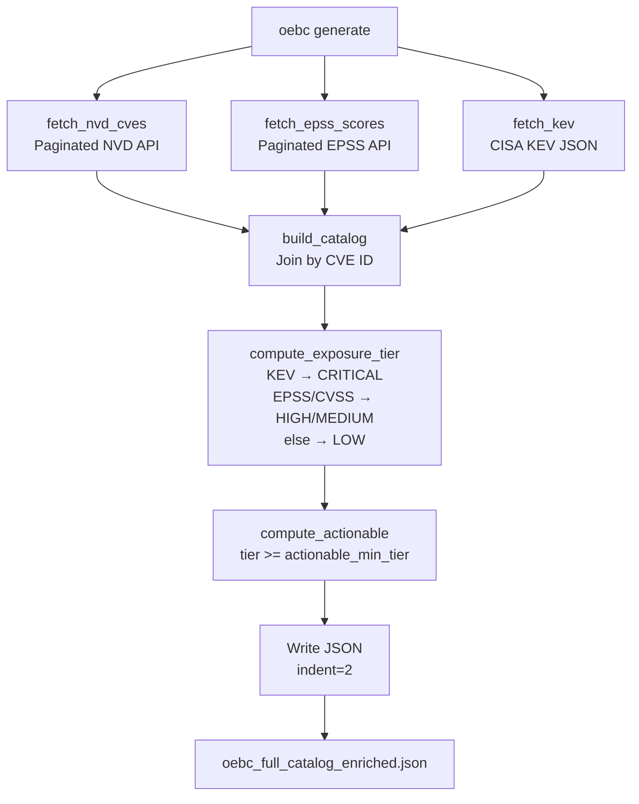

<div align="center">

# Open Exposure Baseline Catalog (OEBC)

**Machine-Readable CVE Exposure Baseline enriched with EPSS, KEV, and Derived Exposure Tiers**

[](https://github.com/sadayamuthu/oebc/actions/workflows/develop.yml)
[](https://www.python.org/)
[](LICENSE)
[](https://openastra.org/oebc/catalog/v0.1/latest.json)
[](https://openastra.org/oebc/schema/v0.1/oebc.json)

[Catalog](#catalog) · [Quick Start](#quick-start) · [CLI](#cli-usage) · [Schema](#output-schema) · [Automation](#automation)

</div>

---

## What is OEBC?

OEBC is a daily, machine-readable, cloud-agnostic **exposure baseline catalog** derived from three authoritative sources:

- **[NVD](https://nvd.nist.gov/)** — CVE descriptions, CVSS scores, CWE IDs, published/modified dates
- **[FIRST.org EPSS](https://www.first.org/epss/)** — Exploitation probability score and percentile per CVE
- **[CISA KEV](https://www.cisa.gov/known-exploited-vulnerabilities-catalog)** — Known Exploited Vulnerabilities with ransomware use flags

Every CVE is enriched with derived fields (`exposure_tier`, `actionable`) and published as a complete, self-contained JSON catalog at:

**`https://openastra.org/oebc/catalog/v0.1/latest.json`**

OEBC is consumed by **ExposureGate**, a CTEM (Continuous Threat Exposure Management) platform built on exposure baselines.

---

## How It Works

```
NVD CVE API         FIRST.org EPSS       CISA KEV
(250k+ CVEs)        (EPSS scores)        (Known exploited)
     │                    │                    │
     └────────────────────┴────────────────────┘
                          │
                    oebc generate
                          │
                   Join by CVE ID
                          │
              Enrich: exposure_tier + actionable
                          │
               ┌──────────┴──────────┐
               │                     │
         latest.json        historical/YYYY-MM-DD.json
               │
         openastra.org/oebc/catalog/v0.1/
```

---

## Catalog

| Artifact | URL |
|----------|-----|
| Latest catalog | `https://openastra.org/oebc/catalog/v0.1/latest.json` |
| Historical catalog | `https://openastra.org/oebc/catalog/v0.1/historical/{YYYY-MM-DD}.json` |
| JSON Schema | `https://openastra.org/oebc/schema/v0.1/oebc.json` |
| YAML Schema | `https://openastra.org/oebc/schema/v0.1/oebc.yaml` |

---

## Quick Start

**Download the pre-built catalog (fastest):**

```bash
curl -L https://openastra.org/oebc/catalog/v0.1/latest.json -o oebc_catalog.json
```

**Or use the CLI:**

```bash
pip install oebc

# Download pre-built catalog from openastra.org
oebc fetch

# Generate catalog from scratch (fetches all live sources)
oebc generate
```

**Or run from source:**

```bash
git clone https://github.com/sadayamuthu/oebc.git
cd oebc
make install-dev
make generate
```

---

## Features

- **250k+ CVEs** — full NVD catalog, updated daily
- **Three authoritative sources** — NVD, EPSS, CISA KEV joined by CVE ID
- **Derived exposure tiers** — CRITICAL / HIGH / MEDIUM / LOW with configurable thresholds
- **Actionable flag** — boolean shortcut for tiers at or above a configurable minimum
- **Null-safe enrichment** — missing CVSS or EPSS scores handled gracefully
- **Configurable thresholds** — EPSS cutoffs and CVSS bands exposed as CLI flags
- **Retry-resilient** — exponential backoff on NVD / EPSS / KEV HTTP failures
- **Schema-validated** — JSON Schema Draft 2020-12 with `additionalProperties: false`
- **PyPI package** — `pip install oebc`

---

## CLI Usage

### `oebc fetch`

Download the pre-built catalog from openastra.org (fast, no live API calls).

```bash
oebc fetch
oebc fetch --out my-catalog.json
```

| Flag | Default | Description |
|------|---------|-------------|
| `--out` | `oebc_full_catalog_enriched.json` | Output file path |

### `oebc generate`

Fetch NVD + EPSS + CISA KEV live and generate the full enriched catalog.

```bash
oebc generate
oebc generate --out catalog.json \
              --actionable_min_tier high \
              --epss_high_threshold 0.10 \
              --epss_medium_threshold 0.01 \
              --nvd_api_key YOUR_KEY
```

| Flag | Default | Description |
|------|---------|-------------|
| `--out` | `oebc_full_catalog_enriched.json` | Output file path |
| `--actionable_min_tier` | `medium` | Minimum tier for `actionable=true` (`low`, `medium`, `high`, `critical`) |
| `--epss_high_threshold` | `0.10` | EPSS score threshold for HIGH tier |
| `--epss_medium_threshold` | `0.01` | EPSS score threshold for MEDIUM tier |
| `--nvd_url` | NVD API URL | Override NVD source URL |
| `--epss_url` | FIRST.org EPSS URL | Override EPSS source URL |
| `--kev_url` | CISA KEV JSON URL | Override KEV source URL |
| `--nvd_api_key` | *(none)* | NVD API key for higher rate limits (optional) |

---

## Output Schema

### Top-Level Structure

```json
{
  "project": "Open Exposure Baseline Catalog (OEBC)",
  "project_version": "0.1.0",
  "generated_at_utc": "2026-03-16T06:00:00Z",
  "sources": {
    "nvd": "https://services.nvd.nist.gov/rest/json/cves/2.0",
    "epss": "https://api.first.org/data/v1/epss",
    "kev": "https://www.cisa.gov/sites/default/files/feeds/known_exploited_vulnerabilities.json"
  },
  "rules": { ... },
  "count": 250000,
  "vulnerabilities": [ ... ]
}
```

### Per-CVE Record

```json
{
  "cve_id": "CVE-2021-44228",
  "description": "Apache Log4j2 JNDI...",
  "published_date": "2021-12-10",
  "last_modified_date": "2023-03-17",
  "cwe_ids": ["CWE-917", "CWE-20"],
  "cvss_score": 10.0,
  "cvss_vector": "CVSS:3.1/AV:N/AC:L/PR:N/UI:N/S:C/C:H/I:H/A:H",
  "cvss_version": "3.1",
  "cvss_severity": "CRITICAL",
  "epss_score": 0.97566,
  "epss_percentile": 0.99983,
  "kev_listed": true,
  "kev_date_added": "2021-12-10",
  "kev_due_date": "2021-12-24",
  "kev_ransomware_use": "Known",
  "exposure_tier": "CRITICAL",
  "actionable": true
}
```

### Field Reference

| Field | Type | Description |
|-------|------|-------------|
| `cve_id` | string | CVE identifier (e.g., `CVE-2021-44228`) |
| `description` | string | English description from NVD |
| `published_date` | string | ISO 8601 date first published |
| `last_modified_date` | string | ISO 8601 date last modified |
| `cwe_ids` | array | CWE identifiers (empty array if none) |
| `cvss_score` | number \| null | CVSS base score (prefers v3.1 > v3.0) |
| `cvss_vector` | string \| null | CVSS vector string |
| `cvss_version` | string \| null | CVSS version (`3.1`, `3.0`) |
| `cvss_severity` | string \| null | CVSS severity label |
| `epss_score` | number \| null | EPSS probability (0–1); null if not yet scored |
| `epss_percentile` | number \| null | EPSS percentile (0–1); null if not yet scored |
| `kev_listed` | boolean | `true` if in CISA KEV |
| `kev_date_added` | string \| null | Date added to KEV; null if not listed |
| `kev_due_date` | string \| null | CISA remediation due date; null if not listed |
| `kev_ransomware_use` | string \| null | Ransomware use flag from KEV; null if not listed |
| `exposure_tier` | string | Derived tier: `LOW`, `MEDIUM`, `HIGH`, `CRITICAL` |
| `actionable` | boolean | `true` if tier ≥ `actionable_min_tier` |

---

## Exposure Tier Rules

Tiers are evaluated in priority order; first match wins.

| Tier | Condition |
|------|-----------|
| `CRITICAL` | `kev_listed = true` |
| `HIGH` | `epss_score >= 0.10` OR `cvss_score >= 9.0` |
| `MEDIUM` | `epss_score >= 0.01` OR `cvss_score >= 7.0` |
| `LOW` | everything else |

**Null handling:** null CVSS or EPSS scores evaluate as `false` in threshold comparisons — they never qualify for a higher tier.

**`actionable`:** `true` when `exposure_tier` ≥ `actionable_min_tier` (default: `medium`), so tiers `{MEDIUM, HIGH, CRITICAL}` are actionable by default.

**Threshold ordering:** `LOW < MEDIUM < HIGH < CRITICAL`

---

## Code Flow



---

## Project Structure

```
oebc/
├── .github/workflows/
│   ├── main-release.yml        # Daily catalog generation → publish to openastra.org
│   ├── schema-release.yml      # Schema versioning → publish schema to openastra.org
│   ├── pypi-publish.yml        # Publish to PyPI on v*.*.* tags
│   └── develop.yml             # CI on PRs and pushes to develop branch
├── spec/
│   ├── VERSION                 # Semver schema version (e.g., 0.1.0)
│   └── schemas/
│       ├── oebc-v0.1.json      # JSON Schema Draft 2020-12
│       └── oebc-v0.1.yaml      # YAML equivalent
├── src/oebc/
│   ├── __init__.py             # Package version
│   ├── __main__.py             # Entry point
│   ├── cli.py                  # CLI dispatcher (fetch/generate)
│   ├── fetch.py                # Download pre-built catalog from openastra.org
│   ├── generate.py             # Core: fetch NVD+EPSS+KEV, join, enrich, output
│   └── urls.py                 # Default source URLs
├── tests/
│   ├── test_cli.py
│   ├── test_fetch.py
│   ├── test_generate.py
│   └── test_schema_validation.py
├── Makefile
├── pyproject.toml
└── README.md
```

> **Note:** No `baseline/` or `historical/` directory. Catalog artifacts are generated ephemerally in CI and pushed directly to openastra.org — the repo stays clean.

---

## Automation

OEBC ships four GitHub Actions workflows:

### `develop.yml` — Development CI

Triggered on push to `develop` and pull requests targeting `develop` or `main`.

- Lint with ruff
- Full test suite across Python 3.11, 3.12, 3.13

### `main-release.yml` — Daily Catalog Generation

Triggered on schedule (daily 06:00 UTC), push to `main`, and manual dispatch.

1. Test across Python 3.11, 3.12, 3.13
2. `oebc generate --out oebc_full_catalog_enriched.json` (ephemeral)
3. Publish `latest.json` + `historical/YYYY-MM-DD.json` to `openastra.org/oebc/catalog/v0.1/`
4. Create GitHub Release tagged `baseline-YYYY-MM-DD`

Requires secret: `OEBC_DEPLOY_TOKEN`

### `schema-release.yml` — Schema Publishing

Triggered on push to `main` affecting `spec/**`.

1. Validate `spec/VERSION` (semver); abort if tag already exists
2. Publish schema files to `openastra.org/oebc/schema/v{MAJOR.MINOR}/`
3. Create GitHub Release tagged `spec-v{VERSION}` with schema files attached

Requires secret: `OEBC_DEPLOY_TOKEN`

### `pypi-publish.yml` — PyPI Publishing

Triggered on push of any `v*.*.*` tag.

1. Build Python package
2. Publish to PyPI via OIDC Trusted Publishing (no API token required)

---

## Development

```bash
# Install with dev dependencies + pre-commit hooks
make install-dev

# Run tests
make test

# Run tests with 100% coverage report
make test-cov

# Lint
make lint

# Auto-format
make format

# Lint + test-cov
make check

# Generate catalog locally
make generate
```

---

## Data Sources

| Source | URL | What it provides |
|--------|-----|-----------------|
| NVD CVE API | `https://services.nvd.nist.gov/rest/json/cves/2.0` | All CVEs: description, CVSS score/vector/version/severity, CWE IDs, dates |
| EPSS API | `https://api.first.org/data/v1/epss` | Exploitation probability score (0–1) + percentile per CVE |
| CISA KEV | `https://www.cisa.gov/sites/default/files/feeds/known_exploited_vulnerabilities.json` | Known exploited CVEs with `dateAdded`, `dueDate`, ransomware use |

All sources are fetched live at generation time. No local data files committed to the repo.

---

## License

MIT — see [LICENSE](LICENSE).

---

<div align="center">

[Catalog](https://openastra.org/oebc/catalog/v0.1/latest.json) · [Schema](https://openastra.org/oebc/schema/v0.1/oebc.json) · [PyPI](https://pypi.org/project/oebc/) · [openastra.org](https://openastra.org)

</div>
